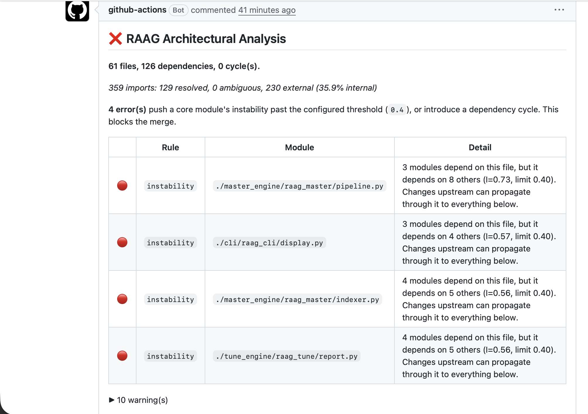

<div align="center">


</div>
<br>

```yaml
role: Software Engineer — Systems, AI Infrastructure & LLM Inference
stack: [C++20, CUDA, Python]
focus: >-
  Inference engines, vector databases, and dependency-graph systems,
  built from scratch and verified against real references, not assumed.
principle: Every number in these repos is measured, not estimated.
```

<br>

<div align="center">


</div>

---

### 🏆 Key Achievements

- 🔧 **Two CUDA contributions merged into llama.cpp's master branch** (120,000+ ★ open-source LLM inference engine) — a 1D pooling kernel merged by the project's creator, and i16/i32 tensor support for the CUDA DUP operator, verified against the full 16,097-test backend suite
- 📦 **Published `pylattice-db` to PyPI** — an embedded vector database built entirely from scratch, installable via `pip`
- 🧩 **Published a VS Code extension** for RAAG, surfacing live architectural metrics inline in the editor
- ✅ **Verified an LLM's full forward pass against HuggingFace** to a 3e-5 max logit deviation — numerical agreement, not just plausible output
- ⚡ **343x CUDA speedup** on custom kernels, **3.69x parallel speedup** on a C++ parsing engine — both independently benchmarked, not estimated
- 🛡️ **Built CI gates that block real violations** — RAAG's instability gate and Lattice's benchmark-regression gate both fail a build automatically, not just lint it

---

### 🛠️ Skills

**Languages:** C++20 · Python · CUDA · SQL

**Data Structures & Algorithms:** Graphs (BFS/DFS, Topological Sort, Cycle Detection) · Dynamic Programming · Hashing · Heaps · Two Pointers · Bit Manipulation

**Low-Level Design & Systems:** OOP · SOLID Principles · Design Patterns · Multithreading (`std::jthread`, `std::atomic`) · RAII & Smart Pointers · Cache-Aware Design

**AI, LLM & Agentic Systems:** LLM Inference · Retrieval-Augmented Generation (RAG) · GraphRAG · Agentic AI Workflows · Vector Databases · HNSW · INT8 Quantization · `pybind11`

**Tools & DevOps:** CMake · Git · GitHub Actions (CI/CD) · Docker · FastAPI · PyPI Packaging · Linux

---

### 🔧 Open Source Contributions

**[llama.cpp](https://github.com/ggml-org/llama.cpp)** — open-source LLM inference engine (120,000+ ★) · **2 merged pull requests**

**CUDA kernel for 1D pooling** — Implemented average and max modes, closing a gap in GPU backend operator coverage. Verified across 216 automated test cases spanning every kernel size, stride, and padding combination, on two Nvidia T4 GPUs. **Merged into master by the project's creator** following code review.

→ [PR #27573](https://github.com/ggml-org/llama.cpp/pull/27573)

**i16 and i32 support for the CUDA DUP operator** — Both types were silently falling back to CPU. The i32 copy path already existed but was blocked by the backend capability gate; i16 had no path at all. Fixed the gate and added the missing i16 branch. Verified on two Nvidia T4 GPUs against the full backend suite — 16,097 tests, zero regressions. **Approved by the project's creator and merged the same day.**

→ [PR #28897](https://github.com/ggml-org/llama.cpp/pull/28897)

---

### 🚀 Featured Projects

Three systems, built from scratch, each independently verified rather than assumed to work.

<br>

#### [verbum.cpp](https://github.com/amankarki151/verbum.cpp) — LLM Inference Engine


An LLM inference engine written from scratch in C++ and CUDA — no PyTorch, no llama.cpp doing the math.

- Engineered the full pipeline from scratch: tokenizer, attention, KV-cache, sampling — no dependency on PyTorch or an existing inference runtime
- Validated the entire forward pass against real HuggingFace output to a **3e-5 max logit deviation** — a process that caught two real, non-crashing bugs (a RoPE convention mismatch, a grouped-query attention mapping error) before they could ship
- Designed custom CUDA kernels (tiled matmul, RMSNorm, RoPE, grouped-query attention) achieving **723 GFLOP/s, a 343x speedup** over the CPU baseline, with output verified exactly against the CPU path
- Built an INT8 post-training quantization pipeline cutting quantized-layer memory **4x** with exact-match correctness
- Integrated with Lattice via `pybind11` to build a memory-augmented offline demo — an NPC that genuinely remembers what you told it, correctly managing the GIL to keep the app responsive

`C++20` `CUDA` `Python` `pybind11`

📺 [Demo](https://youtu.be/aP7grDJjJMA) · 📦 [Repo](https://github.com/amankarki151/verbum.cpp) · ✍️ [Writeup](https://amankarki.hashnode.dev/what-actually-happens-inside-a-transformer-forward-pass)

<br>

#### [Lattice](https://github.com/amankarki151/lattice) — Embedded Vector Database

An embedded vector database built from scratch in C++ — closer to SQLite than to a service like Qdrant.

- Hand-implemented a **HNSW (Hierarchical Navigable Small World)** index from the paper, not a library call
- Built a write-ahead-logged, disk-backed storage engine with crash recovery, and a concurrent query path validated under ThreadSanitizer
- Benchmarked at **583µs p50 latency, 95.4% recall** on the SIFT dataset — roughly **3.5x faster** than Qdrant's in-memory mode on the same workload
- Reported the honest tradeoff alongside the win: build time is slower — said so directly rather than only publishing the flattering number
- Implemented scalar quantization (float32→uint8), reducing per-vector storage 4x with the accuracy tradeoff directly measured
- **Published to PyPI as `pylattice-db`** via `pybind11` bindings, backed by 30 automated GoogleTest cases and a CI pipeline that fails builds on benchmark regressions

`C++20` `Python` `HNSW` `pybind11` `FastAPI` `CMake`

📦 [PyPI](https://pypi.org/project/pylattice-db/) · 📦 [Repo](https://github.com/amankarki151/lattice) · ✍️ [Writeup](https://amankarki.hashnode.dev/building-an-hnsw-index-from-scratch)

<br>

#### [RAAG](https://github.com/amankarki151/RAAG) — AI-Powered Architectural Analytics Platform



Parses a codebase, builds a real dependency graph, and scopes AI-assisted refactoring to exactly the blast radius a change can reach.

- Engineered a parallel C++20 source-parsing engine using a `std::jthread` pool with cooperative cancellation via `std::stop_token` — a **3.69x speedup** (1,290 vs. 349 files/sec) across 579 real-world files with zero parse failures
- Designed a dependency-graph analytics engine computing coupling, instability, and LCOM (Lack of Cohesion of Methods) metrics — surfacing real threshold violations and circular dependencies across 913 dependency edges
- Built a GraphRAG pipeline scoping AI refactoring suggestions to a computed blast radius via metadata-filtered vector search in Qdrant, not unbounded similarity search
- Implemented a self-hosted **CI/CD gate in GitHub Actions** that automatically blocks a pull request when a core module's instability score exceeds threshold — shown above, a real PR it actually blocked
- Achieved **86% test coverage across 307 tests**
- **Published as a VS Code extension**, surfacing live coupling and instability metrics inline in the editor — wrapping the existing CLI rather than duplicating logic, to guarantee output parity

`C++20` `Python` `GraphRAG` `Docker` `GitHub Actions`

📺 [Demo](https://youtu.be/kbh707DNPeU) · 📦 [Repo](https://github.com/amankarki151/RAAG) · 🧩 [VS Code Extension](https://marketplace.visualstudio.com/items?itemName=amankarki151.raag-vscode) · ✍️ [Writeup](https://amankarki.hashnode.dev/parallel-cpp-source-parser-jthread-stop-token)

<br>

> Lattice and verbum.cpp already talk to each other for real — an NPC's memory, stored and retrieved by Lattice, generated by verbum.cpp. RAAG still calls Qdrant and Claude's API. Closing that gap is next — the full story: [**Two From-Scratch Systems, and the Day They Talked**](https://amankarki.hashnode.dev/two-from-scratch-systems-and-the-day-they-talked)

---

### ✍️ Writing

**RAAG**
- [Building a Parallel C++ Source Parser: jthread, stop_token, and the Deadlock I Didn't See Coming](https://amankarki.hashnode.dev/parallel-cpp-source-parser-jthread-stop-token)
- [I Ran a Coupling Analyzer on nlohmann/json and fmt. It Found a Class Doing 55 Jobs](https://amankarki.hashnode.dev/cpp-coupling-metrics-nlohmann-json-fmt)
- [I Built an AI Refactoring Tool That Can't See More Code Than the Dependency Graph Allows](https://amankarki.hashnode.dev/graphrag-code-refactoring-blast-radius)

**Lattice**
- [Building an HNSW Index From Scratch](https://amankarki.hashnode.dev/building-an-hnsw-index-from-scratch)
- [Benchmarking Against Qdrant and Chroma](https://amankarki.hashnode.dev/vector-database-vs-qdrant-chroma-benchmark)
- [What I Learned Building a Storage Engine From Scratch (and What I'd Change)](https://amankarki.hashnode.dev/what-i-learned-building-a-storage-engine-from-scratch-and-what-i-d-change)

**verbum.cpp**
- [What Actually Happens Inside a Transformer Forward Pass](https://amankarki.hashnode.dev/what-actually-happens-inside-a-transformer-forward-pass)
- [INT8 Quantization the Second Time Around](https://amankarki.hashnode.dev/int8-quantization-the-second-time-around)
- [Two From-Scratch Systems, and the Day They Talked](https://amankarki.hashnode.dev/two-from-scratch-systems-and-the-day-they-talked)

---

<div align="center">

### 📫 Find Me

[LinkedIn](https://www.linkedin.com/in/aman-karki-131761197) · [Hashnode](https://amankarki.hashnode.dev) · [Portfolio](https://aman-portfolio-rho-six.vercel.app) · [Email](mailto:itsamankarki@gmail.com)

</div>
