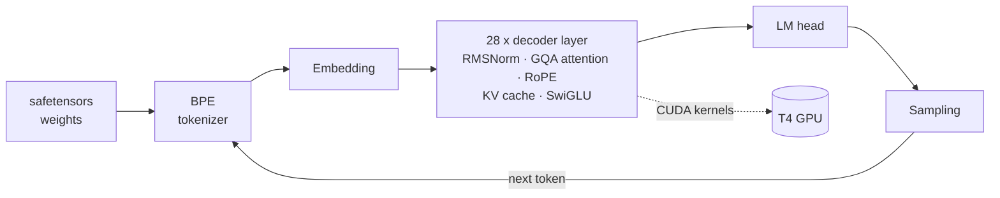

<h1>Aman Karki</h1>

<b>C++/CUDA Engineer · LLM Inference &amp; GPU Performance</b>

  

 

I write **C++ and CUDA**, mostly for **LLM inference**. I build systems from the ground up, **check them against a trusted reference**, and **publish the numbers**, including the ones that don't flatter me.

 

<table>
<tr>
<td align="center" width="25%"><h3>2 merged PRs</h3>CUDA backend of <b>llama.cpp</b> (100K+ ★)</td>
<td align="center" width="25%"><h3>28 tok/s</h3>decode on a T4 from <b>my own CUDA kernels</b></td>
<td align="center" width="25%"><h3>3e-5</h3>max logit error <b>vs HuggingFace</b></td>
<td align="center" width="25%"><h3>1.37–2.81x</h3>FP8 path over Marlin <b>on an L4 (vLLM, measured)</b></td>
</tr>
</table>

> [!NOTE]
> **2 CUDA PRs merged into llama.cpp**, reviewed and merged by its maintainers including creator **Georgi Gerganov**, and now **working on block-FP8 GEMM support for Ada GPUs in vLLM**. Plus **three systems built from scratch**: an LLM inference engine, a vector database and a code analyzer.

---

## 🔧 Open source

### vLLM: block-FP8 on Ada GPUs (working on)

 

Block-quantized FP8 models (DeepSeek-style 128×128 scales) on Ada GPUs (L4, L40S, RTX 4090) fall back to Marlin, a weight-only kernel, so the FP8 tensor cores sit idle. I measured the cost first: on an L4, an FP8 tensor-core GEMM path ran **1.37–2.81x faster than Marlin at batch 256+** across 4 Qwen3-8B layer shapes, while Marlin stays ahead at decode sizes.

| What | Status |
|---|---|
| [**#58241**](https://github.com/vllm-project/vllm/issues/58241): SM89 blockwise FP8 GEMM. CUTLASS's Ada blockwise kernel adapted to vLLM's per-token activation scales and wired into vLLM; compiles to Ada's FP8 tensor-core instructions (QMMA) | ✅ correct on an L4 · 🔨 tuning speed (profiling found register spills; spill-free fix in testing) |
| [**#60171**](https://github.com/vllm-project/vllm/pull/60171): run the block-FP8 kernel tests on Ada (SM89); 221 passed on an L4 | 🟣 Open |
| [**#59261**](https://github.com/vllm-project/vllm/pull/59261): fix for the broken block-FP8 GEMM benchmark | 🟣 Open |
| Enable the block-FP8 kernel tests on SM89 | 🟣 Opening next |

Write-up: [Blockwise FP8 on Ada GPUs: why your L4 falls back to Marlin, measured](https://medium.com/gitconnected/e74a0dfa3024) (Level Up Coding)

### llama.cpp: CUDA backend

  

Contributing to the CUDA backend since **Aug 2026**.

| PR | What it does | How it was verified | Status |
|---|---|---|---|
| [**#27573**](https://github.com/ggml-org/llama.cpp/pull/27573) | **New CUDA kernel for `POOL_1D`** (average and max), closing a gap in GPU operator coverage | Every kernel size, stride and padding combination: **216 cases** on two T4s | ✅ **Merged by Georgi Gerganov** |
| [**#28897**](https://github.com/ggml-org/llama.cpp/pull/28897) | **i16/i32 for `GGML_OP_DUP` on CUDA.** Both were silently falling back to the CPU: fixed the capability check and added the missing i16 path | Full backend suite: **16,097/16,097 passing, zero regressions** | ✅ **Approved by Georgi Gerganov**, merged by am17an |

---

## 🚀 Projects

<table>
<tr>
<th width="6%">#</th><th width="26%">Project</th><th>What it is</th><th width="26%">Headline result</th>
</tr>
<tr>
<td align="center"><b>01</b></td><td><a href="#01--verbumcpp"><b>verbum.cpp</b></a></td><td>LLM inference engine in C++20 &amp; CUDA, from scratch</td><td><b>28 tok/s</b> on T4 · <b>3e-5</b> vs HF</td>
</tr>
<tr>
<td align="center"><b>02</b></td><td><a href="#02--lattice"><b>Lattice</b></a></td><td>Embedded vector database with a hand-written HNSW index</td><td><b>583 µs</b> p50 @ <b>95.4%</b> recall</td>
</tr>
<tr>
<td align="center"><b>03</b></td><td><a href="#03--raag"><b>RAAG</b></a></td><td>Parallel C++ code analyzer with AI refactoring guardrails</td><td><b>3.69x</b> on 8 cores · <b>1.1M</b> AST nodes</td>
</tr>
</table>

 

### 01 · verbum.cpp
**LLM inference engine, from scratch** &nbsp;·&nbsp; `C++20` `CUDA` `Python`

Runs **Qwen3-0.6B end to end in C++20 and CUDA**, with **no PyTorch and no existing runtime**. The safetensors loader, BPE tokenizer, grouped-query attention, RoPE, SwiGLU, KV cache and sampling are all hand-written.

```mermaid
flowchart LR
    A[safetensors<br/>weights] --> B[BPE<br/>tokenizer]
    B --> C[Embedding]
    C --> D["28 x decoder layer<br/>RMSNorm · GQA attention · RoPE<br/>KV cache · SwiGLU"]
    D --> E[LM head]
    E --> F[Sampling]
    F -->|next token| B
    D -.->|CUDA kernels| G[(T4 GPU)]
```

| | Result |
|---|---|
| **Correctness** | Logits match HuggingFace to **3e-5**. Diffing against that reference caught **5 silent bugs** (RoPE convention, GQA mapping, KV-cache offsets) that gave wrong output without crashing |
| **Speed** | CUDA kernels (tiled matmul, RMSNorm, RoPE, SwiGLU, attention decode) decode at **28 tok/s on a T4**, **38x over CPU on the same machine**, ~25% of the memory-bandwidth roofline |
| **Memory** | Per-row INT8: **3.99x smaller** weight matrices, **all 196 tensors under 1.3% error**, identical greedy output. Also found a duplicate `lm_head` wasting **622 MB** |

 

### 02 · Lattice
**Embedded vector database** &nbsp;·&nbsp; `C++20` `HNSW` `Python`

A vector database you link against, **closer to SQLite than to a service**. HNSW index, WAL storage engine, crash recovery and quantization, **all written from scratch in C++20**.

| | Result |
|---|---|
| **Search** | **583 µs p50 at 95.4% recall** on SIFT10K, **1.3 ms p50 on SIFT1M**. HNSW is **9.4x faster than brute force** at 50K vectors |
| **Storage** | **WAL with crash recovery**, mmap segment files, atomic checkpoints. Concurrent path **clean under ThreadSanitizer** |
| **Honesty** | [Benchmarked against **Qdrant and Chroma**](https://amankarki.hashnode.dev/vector-database-vs-qdrant-chroma-benchmark), with the losses published too (build time is the big one) |
| **Shipping** | **On [PyPI](https://pypi.org/project/pylattice-db/) as `pylattice-db`.** 30 GoogleTest cases, CI that fails on benchmark regressions |

 

### 03 · RAAG
**Architectural analytics platform** &nbsp;·&nbsp; `C++20` `Python` `GraphRAG`

Parses a codebase, builds its **real dependency graph**, and limits AI-assisted refactoring to **the code a change can actually reach**.

| | Result |
|---|---|
| **Parsing** | Parallel C++20 Tree-sitter parser on a `std::jthread` pool: **3.69x on 8 cores**, **1.1M AST nodes** from 579 files, **zero failures** |
| **Analysis** | Coupling, instability and cohesion metrics across **913 dependency edges** in nlohmann/json and fmt |
| **Guardrails** | GraphRAG scoped to a change's blast radius. **A GitHub Actions gate blocks risky PRs** (above: a real one it blocked). **307 tests, 86% coverage** |
| **Shipping** | **[VS Code extension](https://marketplace.visualstudio.com/items?itemName=amankarki151.raag-vscode)** that wraps the same CLI, so the editor and CI always agree |

---

## 🧰 Skills

| | |
|---|---|
| **Languages** | C++20 · CUDA · Python · SQL |
| **GPU & performance** | CUDA kernels · CUTLASS 2.x · tensor cores (FP8 MMA on Ada) · SASS inspection · shared-memory tiling · roofline analysis · FP8/INT8 quantization · benchmarking · multithreading (`std::jthread`, `std::atomic`) |
| **LLM inference** | vLLM · KV cache · grouped-query attention · RoPE · RMSNorm · SwiGLU · BPE tokenization · sampling · safetensors · llama.cpp/ggml · HuggingFace Transformers |
| **Vector search & RAG** | HNSW · scalar quantization · write-ahead logging · mmap storage · Qdrant · Chroma · RAG · GraphRAG |
| **Backend & tools** | CMake · Linux · Git · Docker · GitHub Actions · pybind11 · GoogleTest · ThreadSanitizer · Tree-sitter · FastAPI · SQLite · PyPI |
| **CS fundamentals** | Data structures & algorithms · OOP · SOLID · design patterns · low-level design |

---

## ✍️ Writing

**Eleven articles** on [Hashnode](https://amankarki.hashnode.dev), also on Medium; **two published in [Level Up Coding](https://levelup.gitconnected.com)**. Each one covers **a real bug or a real measurement**.

- [**Two CUDA PRs into llama.cpp, and what they taught me about a 100K-star codebase**](https://medium.com/gitconnected/2abe07a2c1bb) · Level Up Coding
- [**Blockwise FP8 on Ada GPUs: why your L4 falls back to Marlin, measured**](https://medium.com/gitconnected/e74a0dfa3024) · Level Up Coding

<b>Show the other nine</b>

 

**verbum.cpp**
- [What Actually Happens Inside a Transformer Forward Pass](https://amankarki.hashnode.dev/what-actually-happens-inside-a-transformer-forward-pass): five bugs that never crash and just give wrong answers
- [INT8 Quantization the Second Time Around](https://amankarki.hashnode.dev/int8-quantization-the-second-time-around)
- [Two From-Scratch Systems, and the Day They Talked](https://amankarki.hashnode.dev/two-from-scratch-systems-and-the-day-they-talked)

**Lattice**
- [Building an HNSW Index From Scratch](https://amankarki.hashnode.dev/building-an-hnsw-index-from-scratch)
- [Benchmarking Against Qdrant and Chroma](https://amankarki.hashnode.dev/vector-database-vs-qdrant-chroma-benchmark)
- [What I Learned Building a Storage Engine From Scratch (and What I'd Change)](https://amankarki.hashnode.dev/what-i-learned-building-a-storage-engine-from-scratch-and-what-i-d-change)

**RAAG**
- [Building a Parallel C++ Source Parser: jthread, stop_token, and the Deadlock I Didn't See Coming](https://amankarki.hashnode.dev/parallel-cpp-source-parser-jthread-stop-token)
- [I Ran a Coupling Analyzer on nlohmann/json and fmt. It Found a Class Doing 55 Jobs](https://amankarki.hashnode.dev/cpp-coupling-metrics-nlohmann-json-fmt)
- [I Built an AI Refactoring Tool That Can't See More Code Than the Dependency Graph Allows](https://amankarki.hashnode.dev/graphrag-code-refactoring-blast-radius)

---

## 🧭 How I work

> [!TIP]
> - **Diff against a reference.** If there's a trusted implementation, I compare against it number for number before I believe my own output.
> - **Measure on the same machine.** A speedup across two different computers isn't a speedup.
> - **Publish the honest number.** If my system loses a benchmark, the loss goes in the README next to the win.

---

**Currently:** working on block-FP8 GEMM support for Ada GPUs in vLLM ([#58241](https://github.com/vllm-project/vllm/issues/58241)). Open to remote roles in LLM inference and GPU performance; available for interviews from December 2026.

Software Engineer (Independent) since Dec 2025 · B.Tech CSE, UPES (2024) · Before engineering, a year making [music](https://aman-portfolio-rho-six.vercel.app/music.html) full-time.

<a href="mailto:itsamankarki@gmail.com">itsamankarki@gmail.com</a> · <a href="https://www.linkedin.com/in/aman-karki-131761197">LinkedIn</a> · <a href="https://aman-portfolio-rho-six.vercel.app">Portfolio</a>

