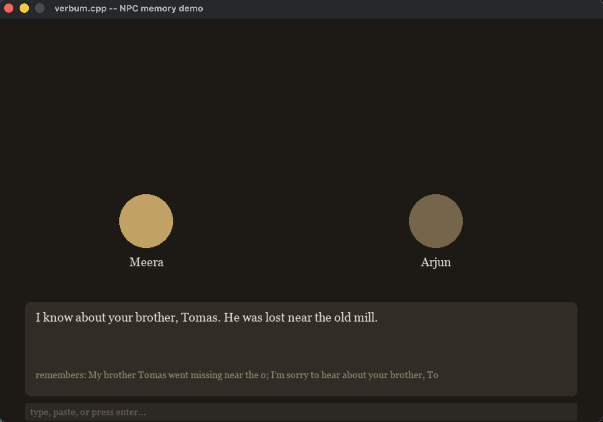
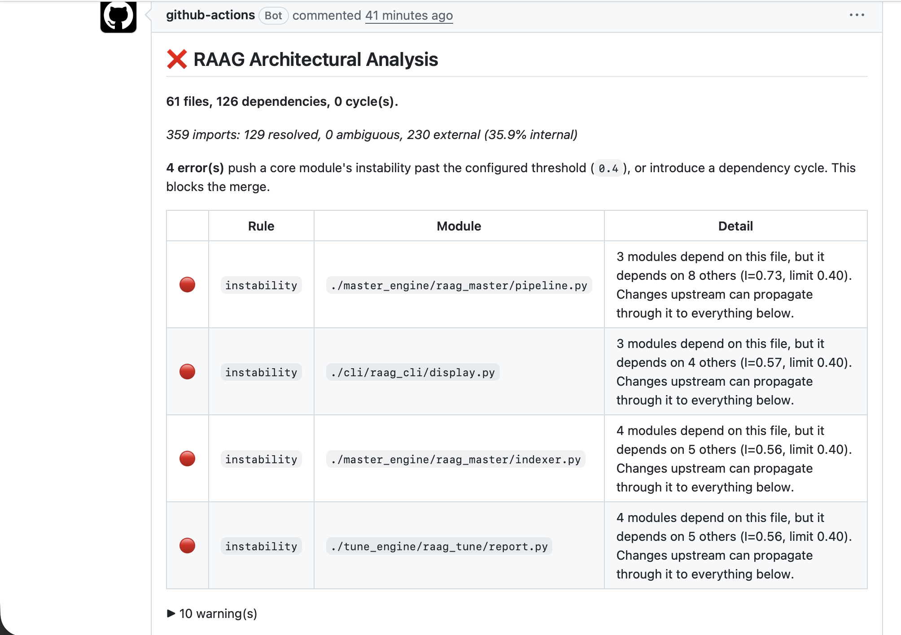

 

I write C++ and CUDA, mostly for LLM inference. I build systems from the ground up, check them against a trusted reference, and publish the numbers, including the ones that don't flatter me.

**Open to C++/CUDA roles in LLM inference and GPU performance. Remote, or in India (GMT+5:30).**

 

<table>
<tr>
<td align="center" width="25%"><h3>2</h3>CUDA PRs merged into <b>llama.cpp</b> (100K+ ★)</td>
<td align="center" width="25%"><h3>28 tok/s</h3>decode on a T4 from my own CUDA kernels</td>
<td align="center" width="25%"><h3>3e-5</h3>max logit error vs HuggingFace</td>
<td align="center" width="25%"><h3>583 µs</h3>p50 at 95.4% recall, my own HNSW index</td>
</tr>
</table>

---

## Open source

**[llama.cpp](https://github.com/ggml-org/llama.cpp)** (ggml-org), CUDA backend. Contributing since Aug 2026, ongoing.

| PR | What it does | How it was verified | Status |
|---|---|---|---|
| [#27573](https://github.com/ggml-org/llama.cpp/pull/27573) | New CUDA kernel for `POOL_1D` (average and max), closing a gap in GPU operator coverage | Every kernel size, stride and padding combination: 216 cases on two T4s | Merged by Georgi Gerganov |
| [#28897](https://github.com/ggml-org/llama.cpp/pull/28897) | i16/i32 for `GGML_OP_DUP` on CUDA. Both were silently falling back to the CPU: fixed the capability check and added the missing i16 path | Full backend suite: 16,097/16,097 passing, zero regressions | Approved by Georgi Gerganov, merged by am17an |

---

## Projects

### [verbum.cpp](https://github.com/amankarki151/verbum.cpp): LLM inference engine, from scratch

Runs Qwen3-0.6B end to end in C++20 and CUDA, with no PyTorch and no existing runtime. The safetensors loader, BPE tokenizer, grouped-query attention, RoPE, SwiGLU, KV cache and sampling are all hand-written.

| Result | Detail |
|---|---|
| **Correctness** | Logits match HuggingFace to 3e-5. Diffing against that reference caught 5 silent bugs (RoPE convention, GQA mapping, KV-cache offsets) that gave wrong output without crashing |
| **Speed** | CUDA kernels (tiled matmul, RMSNorm, RoPE, SwiGLU, attention decode) decode at **28 tok/s on a T4**, **38x** over CPU on the same machine, ~25% of the memory-bandwidth roofline |
| **Memory** | Per-row INT8: **3.99x** smaller weight matrices, all 196 tensors under 1.3% error, identical greedy output. Also found a duplicate `lm_head` wasting 622 MB |

`C++20` `CUDA` `Python` `pybind11` · [Demo](https://youtu.be/aP7grDJjJMA) · [Writeup](https://amankarki.hashnode.dev/what-actually-happens-inside-a-transformer-forward-pass)

### [Lattice](https://github.com/amankarki151/lattice): embedded vector database

A vector database you link against, closer to SQLite than to a service. HNSW index, WAL storage engine, crash recovery and quantization, all written from scratch in C++20.

| Result | Detail |
|---|---|
| **Search** | **583 µs p50 at 95.4% recall** on SIFT10K, 1.3 ms p50 on SIFT1M. HNSW is **9.4x** faster than brute force at 50K vectors |
| **Storage** | WAL with crash recovery, mmap segment files, atomic checkpoints. Concurrent path clean under ThreadSanitizer |
| **Honesty** | [Benchmarked against Qdrant and Chroma](https://amankarki.hashnode.dev/vector-database-vs-qdrant-chroma-benchmark), with the losses published too (build time is the big one) |
| **Shipping** | On [PyPI](https://pypi.org/project/pylattice-db/) as `pylattice-db`. 30 GoogleTest cases, CI that fails on benchmark regressions |

`C++20` `Python` `HNSW` `pybind11` `FastAPI` · [Demo](https://youtu.be/yotdQkAqOkY) · [Writeup](https://amankarki.hashnode.dev/building-an-hnsw-index-from-scratch)

### [RAAG](https://github.com/amankarki151/RAAG): architectural analytics platform

Parses a codebase, builds its real dependency graph, and limits AI-assisted refactoring to the code a change can actually reach.

| Result | Detail |
|---|---|
| **Parsing** | Parallel C++20 Tree-sitter parser on a `std::jthread` pool with `std::stop_token` cancellation: **3.69x on 8 cores**, 1.1M AST nodes from 579 files, zero failures |
| **Analysis** | Coupling, instability and cohesion across 913 dependency edges in nlohmann/json and fmt. [Found a class in fmt with an LCOM4 of 55](https://amankarki.hashnode.dev/cpp-coupling-metrics-nlohmann-json-fmt) |
| **Guardrails** | GraphRAG scoped to a change's blast radius. A GitHub Actions gate blocks PRs that cross an instability threshold (above: a real one it blocked). 307 tests, 86% coverage |
| **Shipping** | [VS Code extension](https://marketplace.visualstudio.com/items?itemName=amankarki151.raag-vscode) that wraps the same CLI, so the editor and CI always agree |

`C++20` `Python` `GraphRAG` `Docker` `GitHub Actions` · [Demo](https://youtu.be/kbh707DNPeU) · [Writeup](https://amankarki.hashnode.dev/parallel-cpp-source-parser-jthread-stop-token)

---

## Skills

| | |
|---|---|
| **Languages** | C++20 · CUDA · Python · SQL |
| **GPU & performance** | CUDA kernels · shared-memory tiling · roofline analysis · INT8 quantization · benchmarking · multithreading (`std::jthread`, `std::atomic`) |
| **LLM inference** | KV cache · grouped-query attention · RoPE · RMSNorm · SwiGLU · BPE tokenization · sampling · safetensors · llama.cpp/ggml · HuggingFace Transformers |
| **Vector search & RAG** | HNSW · scalar quantization · write-ahead logging · mmap storage · Qdrant · Chroma · RAG · GraphRAG |
| **Tools** | CMake · Linux · Git · Docker · GitHub Actions · pybind11 · GoogleTest · ThreadSanitizer · Tree-sitter · FastAPI · SQLite · PyPI |
| **CS fundamentals** | Data structures & algorithms · OOP · SOLID · design patterns · low-level design |

---

## Writing

Nine articles on [Hashnode](https://amankarki.hashnode.dev), also republished on Medium via Stackademic. Each one covers a real bug or a real measurement.

<b>Show all articles</b>

 

**verbum.cpp**
- [What Actually Happens Inside a Transformer Forward Pass](https://amankarki.hashnode.dev/what-actually-happens-inside-a-transformer-forward-pass): five bugs that never crash and just give wrong answers
- [INT8 Quantization the Second Time Around](https://amankarki.hashnode.dev/int8-quantization-the-second-time-around)
- [Two From-Scratch Systems, and the Day They Talked](https://amankarki.hashnode.dev/two-from-scratch-systems-and-the-day-they-talked)

**Lattice**
- [Building an HNSW Index From Scratch](https://amankarki.hashnode.dev/building-an-hnsw-index-from-scratch)
- [Benchmarking Against Qdrant and Chroma](https://amankarki.hashnode.dev/vector-database-vs-qdrant-chroma-benchmark)
- [What I Learned Building a Storage Engine From Scratch (and What I'd Change)](https://amankarki.hashnode.dev/what-i-learned-building-a-storage-engine-from-scratch-and-what-i-d-change)

**RAAG**
- [Building a Parallel C++ Source Parser: jthread, stop_token, and the Deadlock I Didn't See Coming](https://amankarki.hashnode.dev/parallel-cpp-source-parser-jthread-stop-token)
- [I Ran a Coupling Analyzer on nlohmann/json and fmt. It Found a Class Doing 55 Jobs](https://amankarki.hashnode.dev/cpp-coupling-metrics-nlohmann-json-fmt)
- [I Built an AI Refactoring Tool That Can't See More Code Than the Dependency Graph Allows](https://amankarki.hashnode.dev/graphrag-code-refactoring-blast-radius)

---

## How I work

- **Diff against a reference.** If there's a trusted implementation, I compare against it number for number before I believe my own output.
- **Measure on the same machine.** A speedup across two different computers isn't a speedup.
- **Publish the honest number.** If my system loses a benchmark, the loss goes in the README next to the win.

---

**Currently:** GPU performance work in open-source LLM inference engines.

Software Engineer (Independent) since Dec 2025 · B.Tech CSE, UPES (2024) · Before engineering, a year making [music](https://aman-portfolio-rho-six.vercel.app/music.html) full-time.

<a href="mailto:itsamankarki@gmail.com">itsamankarki@gmail.com</a> · <a href="https://www.linkedin.com/in/aman-karki-131761197">LinkedIn</a> · <a href="https://aman-portfolio-rho-six.vercel.app">Portfolio</a>

